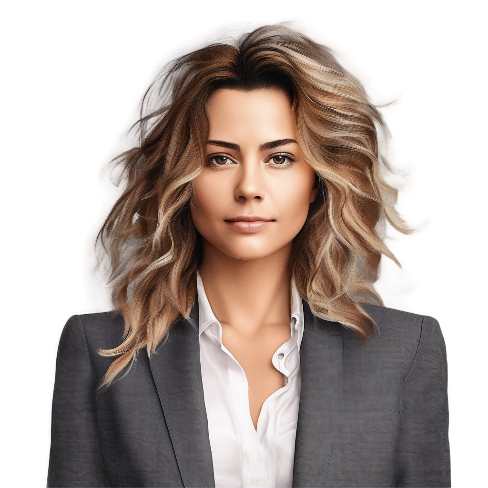
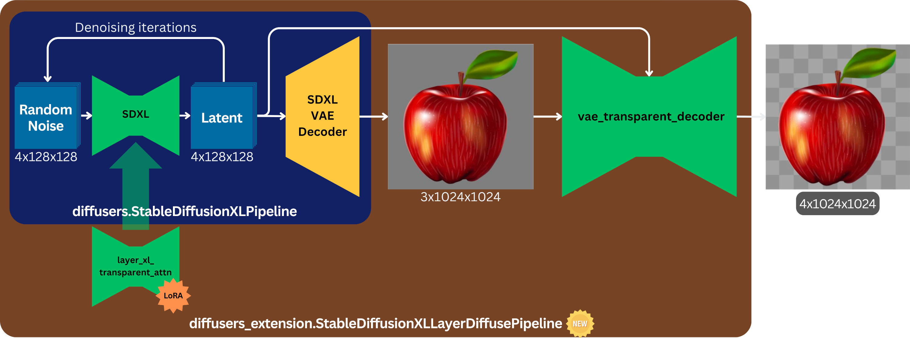

# LayerDiffuse with SDXL for Hugging Face Diffusers

Original paper: [Transparent Image Layer Diffusion using Latent Transparency](https://arxiv.org/abs/2402.17113) by Lvmin Zhang, Maneesh Agrawala

This is a port of [Layer Diffuse](https://github.com/layerdiffusion/LayerDiffuse) from the [SD Forge WebUI extension](https://github.com/layerdiffusion/sd-forge-layerdiffuse) to Hugging Face Diffusers framework.

This port only focuses on SDXL and transparent PNG image generation.

## TL;DR

### Install requirements
```
pip install -r requirements.txt
```

### Run
```
python demo_sdxl_attn.py \
      --prompt "portrait of woman in suit with messy hair, high resolution, photorealistic, uniform textureless background" \
      --negative_prompt "ugly, bad, shadow, artifact, blurry"
```


## Inference
### Snippet
``` python
import torch
from diffusers_extension.pipeline_stable_diffusion_xl_layer_diffuse import StableDiffusionXLLayerDiffusePipeline

pipeline = StableDiffusionXLLayerDiffusePipeline.from_pretrained(
    "stabilityai/stable-diffusion-xl-base-1.0",
    torch_dtype=torch.float16,
    variant="fp16",
).to("cuda")

images = pipeline(
    prompt="portrait of woman in suit with messy hair, high resolution, photorealistic, uniform textureless background",
    negative_prompt="ugly, bad, shadow, artifact, blurry",
    num_inference_steps=20,
    width=1024,
    height=1024,
    generator=torch.Generator(device="cuda").manual_seed(42)
).images

images[0].save("sdxl_layerdiffuse_result.png")
```

### Demo
Check out [demo_sdxl_attn.py](./demo_sdxl_attn.py) for the complete demo.

Full arguments list:
```
python demo_sdxl_attn.py \
      --seed SEED \
      --batch_size BATCH_SIZE \
      --guidance_scale GUIDANCE_SCALE \
      --num_inference_steps NUM_INFERENCE_STEPS \
      --width WIDTH \
      --height HEIGHT \
      --prompt PROMPT \
      --negative_prompt NEGATIVE_PROMPT \
      --output_path OUTPUT_PATH \
      --disable_memory_optim
```

## Implementation details
I created a class `StableDiffusionXLLayerDiffusePipeline` ([code here](./diffusers_extension/pipeline_stable_diffusion_xl_layer_diffuse.py)) deriving from `diffusers.StableDiffusionXLPipeline`.

`StableDiffusionXLLayerDiffusePipeline` can still be initialized with `.from_pretrained()`, as one would do for `diffusers.StableDiffusionXLPipeline`.

Additionally, this new class takes care of:
- Loading the rank-256 LoRA `layer_xl_transparent_attn.safetensors` to turn SDXL into a transparent image generator
  - It will change the latent distribution of the model to a "transparent latent space" that can be decoded by the special VAE pipeline
- Loading `vae_transparent_decoder.safetensors`
  - This is an image decoder that takes SDXL VAE outputs and latent image as inputs, and outputs a real PNG image
- Overload the pipeline's `__call__()` method to automatically forward the output of SDXL (latent + image w/ uniform background) to the VAE Transparent Decoder 




